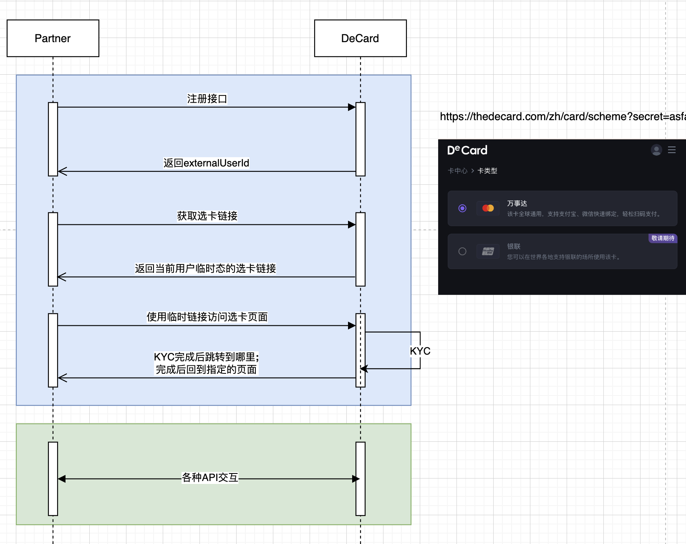

# 交互流程

---


### 1. 新建用户
**描述：** 新建用户
- **URL:** `/account/v1/register`
- **方法:** `POST`
- **请求参数:**

| 名称  | 类型     | 是否必传 | 描述 |
| ------------ |--------|------|----|
|  mobileCode | string | Y    | 国家简码  |
|  mobile | string | Y    | 手机号  |
|  email | string | N    | 邮箱  |

- **响应示例:**

| 名称  | 类型      | 描述               |
| ------------ |---------|------------------|
|  code | string  | SYS_SUCCESS，表示成功 |
|  message |   |  |
|  messageDetail |   |  |
|  success | boolean | true             |
|  data | string  | DeCard用户ID       |

```json
{
    "code": "SYS_SUCCESS",
    "message": null,
    "messageDetail": null,
    "data": "298fe06f-0066-4565-ae20-3697cd9d664e", 
    "success": true
}
```

***

### 2. 获取引导页链接
**描述：** 获取引导页链接

- **URL:** `/redirect/v1/guidance-link`
- **方法:** `POST`
- **请求参数:**

| 名称           | 类型 | 是否必须 | 描述                              |                
| ------------------ | -------- | ---------- |---------------------------------| 
| action             | String   | Y          | 引导页类型<br>[*KYC_GUIDE, CARD_INFO*] |                                                                                          |
| externalUserId     | String   | Y        | DeCard用户ID                      |    
| successRedirectUrl | String   | Y        | 成功后的调整地址                        | 
| errorRedirectUrl   | String   | Y        | 失败后的调整地址                        | 

- **响应:**

| 名称  | 类型      | 描述               |
| ------------ |---------|------------------|
|  code | string  | SYS_SUCCESS，表示成功 |
|  message |   |  |
|  messageDetail |   |  |
|  success | boolean | true             |
|  data | string  | 临时访问链接       |

```json
{
    "code": "SYS_SUCCESS",
    "data": "https://{domain}/{zh|en}/card/{scheme|detail}?secret=qIHyX5xWBJ24PJIcOdmos1piblnglBNoTrw0Ejkqmso",
    "success": true
}
```
- 引导页链接有效期为5分钟；
- 约定referer 、user-agent 等来自partners的信息，只接受约定referer和ua打开页面；
***

### 3. 查询用户状态
**描述：** 获取引导页链接
- **URL:** `/account/v1/user-status`
- **方法:** `POST`
- **请求参数:**

| 名称  | 类型     | 是否必须 | 描述 |
| ------------ |--------|----|----|
|  externalUserId | string | Y  | DeCard用户ID  |

- **响应:**

| 名称  | 类型      | 描述       |
| ------------ |---------|----------|
|  forbidWithdraw | boolean  | 用户是否禁止提现 |
|  forbidCardTransaction | boolean  | 用户是否禁止卡交易 |

```json
{
        "code": "SYS_SUCCESS",
        "message": null,
        "messageDetail": null,
        "data": {
                "forbidWithdraw": false, 
                "forbidCardTransaction": false
        },
        "success": true
}
```


***

### 4. 查看用户KYC状态
**描述：** 获取引导页链接

- **URL:** `/account/v1/kyc-status`
- **方法:** `POST`
- **请求参数:**

| 名称  | 类型  | 是否必须 | 描述 |
| ------------ | ------------ |------|----|
|  externalUserId | String  | YES  | DeCard用户ID  |

- **成功响应:**

| 名称  | 类型      | 描述       |
| ------------ |---------|----------|
|  data | string  | KYC状态 [INIT,REVIEW,PENDING,PASS,REFUSE] |

**响应:**
```json
{
        "code": "SYS_SUCCESS",
        "message": null,
        "messageDetail": null,
        "data": "PASS",
        "success": true
}
```
