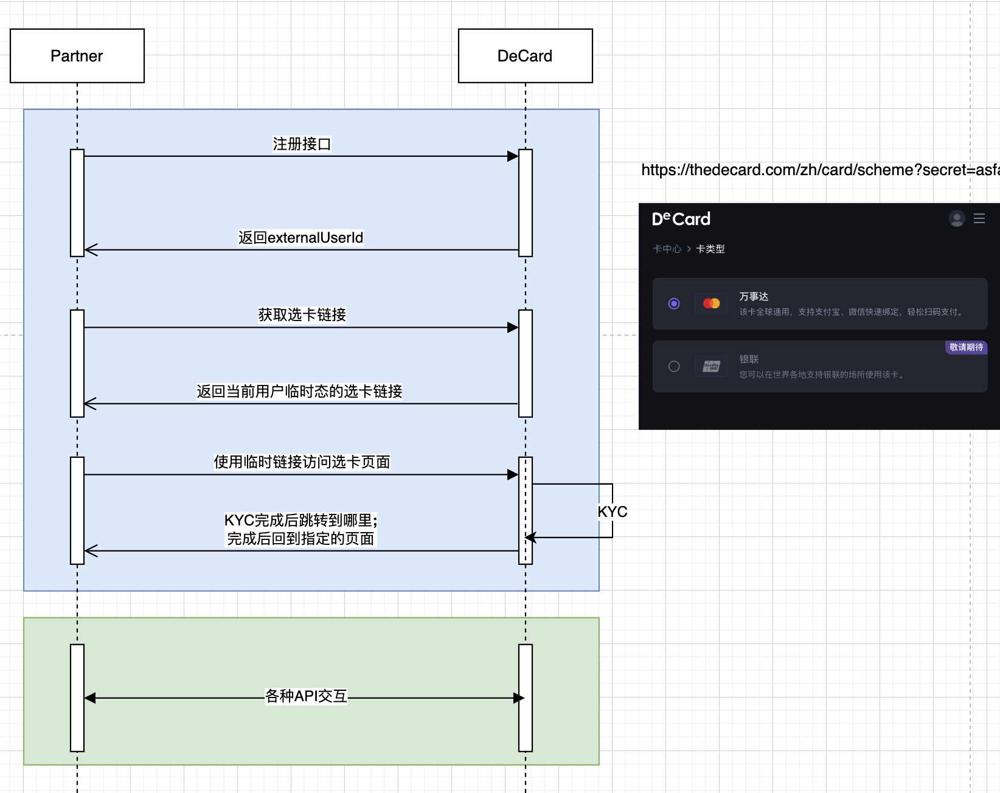
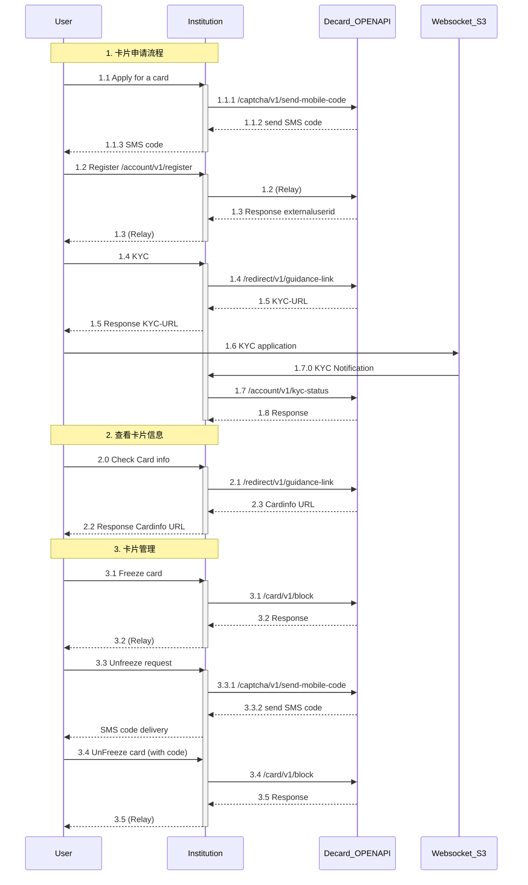

### 逻辑交互流程

---

### 最佳实践


### 接口交互流程

#### AKSK定义
`ApiKey` 作为一种全局唯一的标识符，方便用户身份识别以及数据分析。为防止恶意使用别人的`ApiKey`来发起请求，会采用配对 `SecretKey` 的方式

AKSK通常会组合生成一套签名，并按照一定规则进行加密处理。在请求方发起请求时，需要将这个签名值一并提交给提供方进行验证。 

我们把AKSK私下交付三方平台，三方平台对OPENAPI的任何接口调用都应该遵循约定的签名协议。

#### 签名算法
使用 `HmacSHA256` 算法生成签名，签名计算规则如下：
```
sign(API-KEY + TIMESTAMP + NONCE + payload)
```

- **payload**
```
    if method is GET : 
        payload = original.url().encodedQuery();
    else :
        payload = Body;
```

- **TIMESTAMP:** 主要可用来防止同一个请求参数被无限期的使用，默认只处理5s内的有效请求

- **NONCE:** 由接口请求方生成的随机数，可实现请求一次性有效，避免接口重放攻击


#### 敏感信息加密算法
对于在传输过程有较高安全考量的团队，可以对用户的个人隐私信息采用AES加密算法进行传递。

```java
import cn.hutool.core.codec.Base64;
import cn.hutool.crypto.SecureUtil;
import org.junit.jupiter.api.Test;

public class AES {

    private static final String SECRET = "sjC951Crc3WxH3YXqnJ43v/miI8iCan2iQbK7Km0w1s=";
    
    public static void main(String[] args) {
        String data = "13866668888";
        System.out.println("ORIGIN: " + data);

        String encryptData = SecureUtil.aes(Base64.decode(SECRET)).encryptBase64(data);
        System.out.println("ENCRYPT: " + encryptData);

        String decryptData = SecureUtil.aes(Base64.decode(SECRET)).decryptStr(encryptData);
        System.out.println("DECRYPT: " + decryptData);
    }
}
```